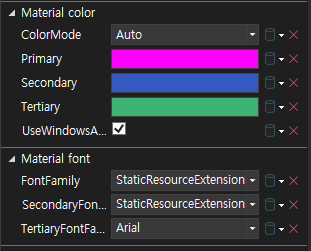
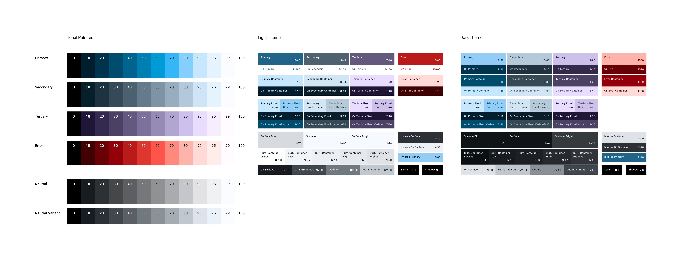

# Peponi.MaterialDesign3.WPF


- [Peponi.MaterialDesign3.WPF](#peponimaterialdesign3wpf)
  - [1. Instruction](#1-instruction)
    - [1.1. About Peponi.MaterialDesign3.WPF](#11-about-peponimaterialdesign3wpf)
      - [1.1.1. Peponi.MaterialDesign3.WPF license](#111-peponimaterialdesign3wpf-license)
      - [1.1.2. Peponi.MaterialDesign3.WPF install](#112-peponimaterialdesign3wpf-install)
  - [2. Quick start](#2-quick-start)
  - [3. MaterialTheme](#3-materialtheme)
    - [3.1. MaterialTheme Members](#31-materialtheme-members)
    - [3.2. FontHelper](#32-fonthelper)
  - [4. Resources](#4-resources)
    - [4.1. MaterialTheme.xaml](#41-materialthemexaml)
    - [4.2. MaterialColor](#42-materialcolor)
    - [4.3. MaterialBrush](#43-materialbrush)
    - [4.4. MaterialFont](#44-materialfont)


## 1. Instruction


- This package is under MIT License.
- GitHub : [Peponi](https://github.com/peponi-paradise/Peponi)
- Blog : [Peponi](https://peponi-paradise.tistory.com)
- Instruction & API information is on following section


### 1.1. About Peponi.MaterialDesign3.WPF


```text
Peponi.MaterialDesign3.WPF is a package for implementing Material design 3 of google.
Contents are:

1. Colors
   - Getting colors using DynamicResource, StaticResource
2. Fonts
   - Getting Font family, size, weight, line height using DynamicResource, StaticResource
```


#### 1.1.1. Peponi.MaterialDesign3.WPF license


```text
The MIT License (MIT)

Copyright (c) 2024 peponi

Permission is hereby granted, free of charge, to any person obtaining a copy
of this software and associated documentation files (the "Software"), to deal
in the Software without restriction, including without limitation the rights
to use, copy, modify, merge, publish, distribute, sublicense, and/or sell
copies of the Software, and to permit persons to whom the Software is
furnished to do so, subject to the following conditions:

The above copyright notice and this permission notice shall be included in all
copies or substantial portions of the Software.

THE SOFTWARE IS PROVIDED "AS IS", WITHOUT WARRANTY OF ANY KIND, EXPRESS OR
IMPLIED, INCLUDING BUT NOT LIMITED TO THE WARRANTIES OF MERCHANTABILITY,
FITNESS FOR A PARTICULAR PURPOSE AND NONINFRINGEMENT. IN NO EVENT SHALL THE
AUTHORS OR COPYRIGHT HOLDERS BE LIABLE FOR ANY CLAIM, DAMAGES OR OTHER
LIABILITY, WHETHER IN AN ACTION OF CONTRACT, TORT OR OTHERWISE, ARISING FROM,
OUT OF OR IN CONNECTION WITH THE SOFTWARE OR THE USE OR OTHER DEALINGS IN THE
SOFTWARE.
```


#### 1.1.2. Peponi.MaterialDesign3.WPF install


```text
Nuget\Install-Package Peponi.MaterialDesign3.WPF
```


## 2. Quick start


- Import resources to App.xaml
    ```xml
      <Application
        x:Class="Peponi.MaterialDesign3.WPF.Tests.App"
        xmlns="http://schemas.microsoft.com/winfx/2006/xaml/presentation"
        xmlns:x="http://schemas.microsoft.com/winfx/2006/xaml"
        xmlns:theme="https://github.com/peponi-paradise/Peponi/MaterialDesign3">
        <Application.Resources>
            <ResourceDictionary>
                <ResourceDictionary.MergedDictionaries>
                    <!-- Contains default resource keys (Optional) -->
                    <!-- If user use this resource, import it first -->
                    <ResourceDictionary Source="/Peponi.MaterialDesign3.WPF;component/MaterialTheme.xaml" />
                    <!-- Theme provider -->
                    <theme:MaterialTheme />
                </ResourceDictionary.MergedDictionaries>
            </ResourceDictionary>
        </Application.Resources>
      </Application>
    ```
- Configure options of theme
    ```xml
      <!-- Xaml -->

      <theme:MaterialTheme
        Primary="Magenta"
        Secondary="#FF3658C3"
        Tertiary="MediumSeaGreen"
        ColorMode="Auto"
        UseWindowsAccentColor="True"

        FontFamily="{StaticResource RobotoFlex}"
        SecondaryFontFamily="{StaticResource RobotoSerif}"
        TertiaryFontFamily="Arial" />
    ```
    ```cs
        // Code

        MaterialTheme.Current.Primary = Colors.Magenta;
        MaterialTheme.Current.Secondary = Color.FromArgb(0xFF, 0x36, 0x58, 0xC3);
        MaterialTheme.Current.Tertiary = Colors.MediumSeaGreen;
        MaterialTheme.Current.ColorMode = ColorMode.Auto;
        MaterialTheme.Current.UseWindowsAccentColor = true;

        MaterialTheme.Current.FontFamily = FontHelper.GetFontFamily("RobotoFlex");
        MaterialTheme.Current.SecondaryFontFamily = FontHelper.GetFontFamily("RobotoSerif");
        MaterialTheme.Current.TertiaryFontFamily = FontHelper.GetFontFamily("Microsoft Sans Serif");
    ```
- User could set properties via property window of designer
    
- User could apply theme resources as `DynamicResource`, `StaticResource` in application xaml
    ```xml
    <Style TargetType="{x:Type Button}">
        <Setter Property="Background" Value="{DynamicResource Brush.Primary}" />
        <Setter Property="Foreground" Value="{DynamicResource Brush.OnPrimary}" />
        <Setter Property="FontFamily" Value="{DynamicResource FontFamily}" />
        <Setter Property="FontSize" Value="{DynamicResource FontSize.BodyMedium}" />
        <Setter Property="FontWeight" Value="{DynamicResource FontWeight.BodyMedium}" />
    </Style>
    ```


## 3. MaterialTheme


- `MaterialTheme` provides color & font set of [Material Design 3](https://m3.material.io/) of google.
- Provided colors are tonal palette as default.
- Three default fonts provided.
    - [Roboto Flex](https://fonts.google.com/specimen/Roboto+Flex)
    - [Roboto Serif](https://fonts.google.com/specimen/Roboto+Serif)
    - [Pretendard](https://fonts.adobe.com/fonts/pretendard)
    - Default font family (See [MaterialTheme Members](#31-materialtheme-members))
        - FontFamily : Roboto Flex
        - SecondaryFontFamily : Roboto Serif
        - TertiaryFontFamily : Pretendard
- Default tonal palette is same as following image
    - Default key color : #00A3E3
    


### 3.1. MaterialTheme Members


1. Members
    |Type|Name|Description|
    |-------|-------|-------|
    |Color|Primary|Primary color of palette<br>This value could not be `null`|
    |Color?|Secondary|Secondary color of palette|
    |Color?|Tertiary|Tertiary color of palette|
    |ColorMode|ColorMode|Set color mode for default color set|
    |bool|UseWindowsAccentColor|Use windows accent color option<br>Supports Windows 10, 11|
    |Dictionary<TonalPalettes, TonalPalette>|ColorPalettes|Current color palettes|
    |FontFamily?|FontFamily|Primary font family|
    |FontFamily?|SecondaryFontFamily|Secondary font family|
    |FontFamily?|TertiaryFontFamily|Tertiary font family|
    |MaterialTheme|Current|Current theme|
2. Methods
    |Return type|Name|Description|
    |-------|-------|-------|
    |void|SetPalettes(Color)|Create tonal spot palette by given color<br>Neutral, Neutral variant colors are decided by primary color|
    |void|SetPalettes(Color, Color?, Color?)|Create tonal spot palette by given color<br>Neutral, Neutral variant colors are decided by primary color|
    |bool|LoadXaml(string)|Sets color, font values by given xaml|
    |bool|SetCollection(Dictionary<string, object>)|Sets color, font values by given dictionary|
3. Example
    ```cs
        MaterialTheme.Current.Primary = Colors.Magenta;
        MaterialTheme.Current.Secondary = Color.FromArgb(0xFF, 0x36, 0x58, 0xC3);
        MaterialTheme.Current.Tertiary = Colors.MediumSeaGreen;
        MaterialTheme.Current.ColorMode = ColorMode.Auto;
        MaterialTheme.Current.UseWindowsAccentColor = false;
        Debug.WriteLine(MaterialTheme.Current.ColorPalettes[Google.MaterialColorUtilities.TonalPalettes.Primary][40]);  // 40 is HCT tone. Color [A=255, R=128, G=77, B=122]

        MaterialTheme.Current.FontFamily = FontHelper.GetFontFamily("RobotoFlex");
        MaterialTheme.Current.SecondaryFontFamily = FontHelper.GetFontFamily("RobotoSerif");
        MaterialTheme.Current.TertiaryFontFamily = FontHelper.GetFontFamily("Microsoft Sans Serif");
    ```
    ```cs
        MaterialTheme.Current.SetPalettes(Colors.DeepPink);
        MaterialTheme.Current.SetPalettes(Colors.DeepPink, Colors.LemonChiffon, Colors.SaddleBrown);
        MaterialTheme.Current.LoadXaml(@"MaterialThemeSetting.xaml");
        Dictionary<string, object> materialThemeSetting = new()
        {
            { MaterialColor.Primary, Colors.Chocolate },
            { MaterialBrush.Primary, Brushes.DarkSalmon },
            { MaterialBrush.OnPrimary, Brushes.Gray },
            { MaterialFont.FontFamily, FontHelper.GetFontFamily("Arial")! }
        };
        MaterialTheme.Current.SetCollection(materialThemeSetting);
    ```
    ```cs
        // Resource dictionary component settings

        MaterialTheme.Current[MaterialBrush.Primary] = Brushes.Aqua;
        MaterialTheme.Current[MaterialBrush.Secondary] = Brushes.Crimson;
        MaterialTheme.Current[MaterialBrush.Tertiary] = Brushes.Beige;

        MaterialTheme.Current[MaterialFont.FontFamily] = FontHelper.GetFontFamily("Microsoft Sans Serif");
        MaterialTheme.Current[MaterialFont.SecondaryFontFamily] = FontHelper.GetFontFamily("Consolas");
        MaterialTheme.Current[MaterialFont.TertiaryFontFamily] = FontHelper.GetFontFamily("Arial");
    ```


### 3.2. FontHelper


1. Methods
    |Return type|Name|Description|
    |-------|-------|-------|
    |FontFamily?|GetFontFamily(string)|Gets font family by given name<br>If name is registered in the resource dictionary, the corresponding value will be returned<br>If not, new instance will be returned|
    |FontFamily?|GetFontFamily(string, string)|Gets font family by given name and uri<br>Uri requires absolute path|
2. Example
    ```cs
        var fontFamily = FontHelper.GetFontFamily("Consolas");
        fontFamily = FontHelper.GetFontFamily("Pretendard Variable", @$"{Environment.CurrentDirectory}\Pretendard.ttf");
    ```


## 4. Resources


- `Peponi.MaterialDesign3.WPF` provides predefined xaml, classes for convinient use


### 4.1. MaterialTheme.xaml


- MaterialTheme.xaml provides keys used to [MaterialTheme](#3-materialtheme)
    <details>
    <summary>MaterialTheme.xaml</summary>

    ```xml
        <ResourceDictionary
            x:Class="Peponi.MaterialDesign3.WPF.MaterialTheme"
            xmlns="http://schemas.microsoft.com/winfx/2006/xaml/presentation"
            xmlns:x="http://schemas.microsoft.com/winfx/2006/xaml"
            xmlns:sys="clr-namespace:System;assembly=System.Runtime">
            <Color x:Key="Color.Primary" />
            <Color x:Key="Color.OnPrimary" />
            <Color x:Key="Color.PrimaryContainer" />
            <Color x:Key="Color.OnPrimaryContainer" />
            <Color x:Key="Color.Secondary" />
            <Color x:Key="Color.OnSecondary" />
            <Color x:Key="Color.SecondaryContainer" />
            <Color x:Key="Color.OnSecondaryContainer" />
            <Color x:Key="Color.Tertiary" />
            <Color x:Key="Color.OnTertiary" />
            <Color x:Key="Color.TertiaryContainer" />
            <Color x:Key="Color.OnTertiaryContainer" />
            <Color x:Key="Color.Error" />
            <Color x:Key="Color.OnError" />
            <Color x:Key="Color.ErrorContainer" />
            <Color x:Key="Color.OnErrorContainer" />
            <Color x:Key="Color.PrimaryFixed" />
            <Color x:Key="Color.PrimaryFixedDim" />
            <Color x:Key="Color.OnPrimaryFixed" />
            <Color x:Key="Color.OnPrimaryFixedVariant" />
            <Color x:Key="Color.SecondaryFixed" />
            <Color x:Key="Color.SecondaryFixedDim" />
            <Color x:Key="Color.OnSecondaryFixed" />
            <Color x:Key="Color.OnSecondaryFixedVariant" />
            <Color x:Key="Color.TertiaryFixed" />
            <Color x:Key="Color.TertiaryFixedDim" />
            <Color x:Key="Color.OnTertiaryFixed" />
            <Color x:Key="Color.OnTertiaryFixedVariant" />
            <Color x:Key="Color.SurfaceDim" />
            <Color x:Key="Color.Surface" />
            <Color x:Key="Color.SurfaceBright" />
            <Color x:Key="Color.SurfaceContainerLowest" />
            <Color x:Key="Color.SurfaceContainerLow" />
            <Color x:Key="Color.SurfaceContainer" />
            <Color x:Key="Color.SurfaceContainerHigh" />
            <Color x:Key="Color.SurfaceContainerHighest" />
            <Color x:Key="Color.OnSurface" />
            <Color x:Key="Color.OnSurfaceVariant" />
            <Color x:Key="Color.Outline" />
            <Color x:Key="Color.OutlineVariant" />
            <Color x:Key="Color.InverseSurface" />
            <Color x:Key="Color.InverseOnSurface" />
            <Color x:Key="Color.InversePrimary" />
            <Color x:Key="Color.Scrim" />
            <Color x:Key="Color.Shadow" />
        
            <SolidColorBrush x:Key="Brush.Primary" />
            <SolidColorBrush x:Key="Brush.OnPrimary" />
            <SolidColorBrush x:Key="Brush.PrimaryContainer" />
            <SolidColorBrush x:Key="Brush.OnPrimaryContainer" />
            <SolidColorBrush x:Key="Brush.Secondary" />
            <SolidColorBrush x:Key="Brush.OnSecondary" />
            <SolidColorBrush x:Key="Brush.SecondaryContainer" />
            <SolidColorBrush x:Key="Brush.OnSecondaryContainer" />
            <SolidColorBrush x:Key="Brush.Tertiary" />
            <SolidColorBrush x:Key="Brush.OnTertiary" />
            <SolidColorBrush x:Key="Brush.TertiaryContainer" />
            <SolidColorBrush x:Key="Brush.OnTertiaryContainer" />
            <SolidColorBrush x:Key="Brush.Error" />
            <SolidColorBrush x:Key="Brush.OnError" />
            <SolidColorBrush x:Key="Brush.ErrorContainer" />
            <SolidColorBrush x:Key="Brush.OnErrorContainer" />
            <SolidColorBrush x:Key="Brush.PrimaryFixed" />
            <SolidColorBrush x:Key="Brush.PrimaryFixedDim" />
            <SolidColorBrush x:Key="Brush.OnPrimaryFixed" />
            <SolidColorBrush x:Key="Brush.OnPrimaryFixedVariant" />
            <SolidColorBrush x:Key="Brush.SecondaryFixed" />
            <SolidColorBrush x:Key="Brush.SecondaryFixedDim" />
            <SolidColorBrush x:Key="Brush.OnSecondaryFixed" />
            <SolidColorBrush x:Key="Brush.OnSecondaryFixedVariant" />
            <SolidColorBrush x:Key="Brush.TertiaryFixed" />
            <SolidColorBrush x:Key="Brush.TertiaryFixedDim" />
            <SolidColorBrush x:Key="Brush.OnTertiaryFixed" />
            <SolidColorBrush x:Key="Brush.OnTertiaryFixedVariant" />
            <SolidColorBrush x:Key="Brush.SurfaceDim" />
            <SolidColorBrush x:Key="Brush.Surface" />
            <SolidColorBrush x:Key="Brush.SurfaceBright" />
            <SolidColorBrush x:Key="Brush.SurfaceContainerLowest" />
            <SolidColorBrush x:Key="Brush.SurfaceContainerLow" />
            <SolidColorBrush x:Key="Brush.SurfaceContainer" />
            <SolidColorBrush x:Key="Brush.SurfaceContainerHigh" />
            <SolidColorBrush x:Key="Brush.SurfaceContainerHighest" />
            <SolidColorBrush x:Key="Brush.OnSurface" />
            <SolidColorBrush x:Key="Brush.OnSurfaceVariant" />
            <SolidColorBrush x:Key="Brush.Outline" />
            <SolidColorBrush x:Key="Brush.OutlineVariant" />
            <SolidColorBrush x:Key="Brush.InverseSurface" />
            <SolidColorBrush x:Key="Brush.InverseOnSurface" />
            <SolidColorBrush x:Key="Brush.InversePrimary" />
            <SolidColorBrush x:Key="Brush.Scrim" />
            <SolidColorBrush x:Key="Brush.Shadow" />
        
            <FontFamily x:Key="FontFamily" />
            <FontFamily x:Key="SecondaryFontFamily" />
            <FontFamily x:Key="TertiaryFontFamily" />
        
            <sys:Double x:Key="FontSize.DisplayLarge">57</sys:Double>
            <sys:Double x:Key="LineHeight.DisplayLarge">64</sys:Double>
            <FontWeight x:Key="FontWeight.DisplayLarge">Regular</FontWeight>
            <sys:Double x:Key="FontSize.DisplayMedium">45</sys:Double>
            <sys:Double x:Key="LineHeight.DisplayMedium">52</sys:Double>
            <FontWeight x:Key="FontWeight.DisplayMedium">Regular</FontWeight>
            <sys:Double x:Key="FontSize.DisplaySmall">36</sys:Double>
            <sys:Double x:Key="LineHeight.DisplaySmall">44</sys:Double>
            <FontWeight x:Key="FontWeight.DisplaySmall">Regular</FontWeight>
        
            <sys:Double x:Key="FontSize.HeadlineLarge">32</sys:Double>
            <sys:Double x:Key="LineHeight.HeadlineLarge">40</sys:Double>
            <FontWeight x:Key="FontWeight.HeadlineLarge">Regular</FontWeight>
            <sys:Double x:Key="FontSize.HeadlineMedium">28</sys:Double>
            <sys:Double x:Key="LineHeight.HeadlineMedium">36</sys:Double>
            <FontWeight x:Key="FontWeight.HeadlineMedium">Regular</FontWeight>
            <sys:Double x:Key="FontSize.HeadlineSmall">24</sys:Double>
            <sys:Double x:Key="LineHeight.HeadlineSmall">32</sys:Double>
            <FontWeight x:Key="FontWeight.HeadlineSmall">Regular</FontWeight>
        
            <sys:Double x:Key="FontSize.TitleLarge">22</sys:Double>
            <sys:Double x:Key="LineHeight.TitleLarge">28</sys:Double>
            <FontWeight x:Key="FontWeight.TitleLarge">Regular</FontWeight>
            <sys:Double x:Key="FontSize.TitleMedium">16</sys:Double>
            <sys:Double x:Key="LineHeight.TitleMedium">24</sys:Double>
            <FontWeight x:Key="FontWeight.TitleMedium">Medium</FontWeight>
            <sys:Double x:Key="FontSize.TitleSmall">14</sys:Double>
            <sys:Double x:Key="LineHeight.TitleSmall">20</sys:Double>
            <FontWeight x:Key="FontWeight.TitleSmall">Medium</FontWeight>
        
            <sys:Double x:Key="FontSize.LabelLarge">14</sys:Double>
            <sys:Double x:Key="LineHeight.LabelLarge">20</sys:Double>
            <FontWeight x:Key="FontWeight.LabelLarge">Medium</FontWeight>
            <sys:Double x:Key="FontSize.LabelMedium">12</sys:Double>
            <sys:Double x:Key="LineHeight.LabelMedium">16</sys:Double>
            <FontWeight x:Key="FontWeight.LabelMedium">Medium</FontWeight>
            <sys:Double x:Key="FontSize.LabelSmall">11</sys:Double>
            <sys:Double x:Key="LineHeight.LabelSmall">16</sys:Double>
            <FontWeight x:Key="FontWeight.LabelSmall">Medium</FontWeight>
        
            <sys:Double x:Key="FontSize.BodyLarge">16</sys:Double>
            <sys:Double x:Key="LineHeight.BodyLarge">24</sys:Double>
            <FontWeight x:Key="FontWeight.BodyLarge">Regular</FontWeight>
            <sys:Double x:Key="FontSize.BodyMedium">14</sys:Double>
            <sys:Double x:Key="LineHeight.BodyMedium">20</sys:Double>
            <FontWeight x:Key="FontWeight.BodyMedium">Regular</FontWeight>
            <sys:Double x:Key="FontSize.BodySmall">12</sys:Double>
            <sys:Double x:Key="LineHeight.BodySmall">16</sys:Double>
            <FontWeight x:Key="FontWeight.BodySmall">Regular</FontWeight>
        
            <FontFamily x:Key="RobotoFlex">./ThemeProvider/#Roboto Flex Normal</FontFamily>
            <FontFamily x:Key="RobotoSerif">./ThemeProvider/#Roboto Serif 20pt</FontFamily>
            <FontFamily x:Key="Pretendard">./ThemeProvider/#Pretendard Variable</FontFamily>
        </ResourceDictionary>
    ```

    </details>


### 4.2. MaterialColor


- `MaterialColor` provides const values used to [MaterialTheme](#3-materialtheme)
    <details>
    <summary>MaterialColor</summary>

    ```cs
        public static class MaterialColor
        {
            private const string ColorPrefix = "Color.";
        
            public const string Primary = $"{ColorPrefix}{nameof(Primary)}";
            public const string OnPrimary = $"{ColorPrefix}{nameof(OnPrimary)}";
            public const string PrimaryContainer = $"{ColorPrefix}{nameof(PrimaryContainer)}";
            public const string OnPrimaryContainer = $"{ColorPrefix}{nameof(OnPrimaryContainer)}";
        
            public const string Secondary = $"{ColorPrefix}{nameof(Secondary)}";
            public const string OnSecondary = $"{ColorPrefix}{nameof(OnSecondary)}";
            public const string SecondaryContainer = $"{ColorPrefix}{nameof(SecondaryContainer)}";
            public const string OnSecondaryContainer = $"{ColorPrefix}{nameof(OnSecondaryContainer)}";
        
            public const string Tertiary = $"{ColorPrefix}{nameof(Tertiary)}";
            public const string OnTertiary = $"{ColorPrefix}{nameof(OnTertiary)}";
            public const string TertiaryContainer = $"{ColorPrefix}{nameof(TertiaryContainer)}";
            public const string OnTertiaryContainer = $"{ColorPrefix}{nameof(OnTertiaryContainer)}";
        
            public const string Error = $"{ColorPrefix}{nameof(Error)}";
            public const string OnError = $"{ColorPrefix}{nameof(OnError)}";
            public const string ErrorContainer = $"{ColorPrefix}{nameof(ErrorContainer)}";
            public const string OnErrorContainer = $"{ColorPrefix}{nameof(OnErrorContainer)}";
        
            public const string PrimaryFixed = $"{ColorPrefix}{nameof(PrimaryFixed)}";
            public const string PrimaryFixedDim = $"{ColorPrefix}{nameof(PrimaryFixedDim)}";
            public const string OnPrimaryFixed = $"{ColorPrefix}{nameof(OnPrimaryFixed)}";
            public const string OnPrimaryFixedVariant = $"{ColorPrefix}{nameof(OnPrimaryFixedVariant)}";
        
            public const string SecondaryFixed = $"{ColorPrefix}{nameof(SecondaryFixed)}";
            public const string SecondaryFixedDim = $"{ColorPrefix}{nameof(SecondaryFixedDim)}";
            public const string OnSecondaryFixed = $"{ColorPrefix}{nameof(OnSecondaryFixed)}";
            public const string OnSecondaryFixedVariant = $"{ColorPrefix}{nameof(OnSecondaryFixedVariant)}";
        
            public const string TertiaryFixed = $"{ColorPrefix}{nameof(TertiaryFixed)}";
            public const string TertiaryFixedDim = $"{ColorPrefix}{nameof(TertiaryFixedDim)}";
            public const string OnTertiaryFixed = $"{ColorPrefix}{nameof(OnTertiaryFixed)}";
            public const string OnTertiaryFixedVariant = $"{ColorPrefix}{nameof(OnTertiaryFixedVariant)}";
        
            public const string SurfaceDim = $"{ColorPrefix}{nameof(SurfaceDim)}";
            public const string Surface = $"{ColorPrefix}{nameof(Surface)}";
            public const string SurfaceBright = $"{ColorPrefix}{nameof(SurfaceBright)}";
        
            public const string SurfaceContainerLowest = $"{ColorPrefix}{nameof(SurfaceContainerLowest)}";
            public const string SurfaceContainerLow = $"{ColorPrefix}{nameof(SurfaceContainerLow)}";
            public const string SurfaceContainer = $"{ColorPrefix}{nameof(SurfaceContainer)}";
            public const string SurfaceContainerHigh = $"{ColorPrefix}{nameof(SurfaceContainerHigh)}";
            public const string SurfaceContainerHighest = $"{ColorPrefix}{nameof(SurfaceContainerHighest)}";
        
            public const string OnSurface = $"{ColorPrefix}{nameof(OnSurface)}";
            public const string OnSurfaceVariant = $"{ColorPrefix}{nameof(OnSurfaceVariant)}";
        
            public const string Outline = $"{ColorPrefix}{nameof(Outline)}";
            public const string OutlineVariant = $"{ColorPrefix}{nameof(OutlineVariant)}";
        
            public const string InverseSurface = $"{ColorPrefix}{nameof(InverseSurface)}";
            public const string InverseOnSurface = $"{ColorPrefix}{nameof(InverseOnSurface)}";
            public const string InversePrimary = $"{ColorPrefix}{nameof(InversePrimary)}";
        
            public const string Scrim = $"{ColorPrefix}{nameof(Scrim)}";
            public const string Shadow = $"{ColorPrefix}{nameof(Shadow)}";
        }
    ```

    </details>


### 4.3. MaterialBrush


- `MaterialBrush` provides const values used to [MaterialTheme](#3-materialtheme)
    <details>
    <summary>MaterialBrush</summary>

    ```cs
        public static class MaterialBrush
        {
            private const string BrushPrefix = "Brush.";
    
            public const string Primary = $"{BrushPrefix}{nameof(Primary)}";
            public const string OnPrimary = $"{BrushPrefix}{nameof(OnPrimary)}";
            public const string PrimaryContainer = $"{BrushPrefix}{nameof(PrimaryContainer)}";
            public const string OnPrimaryContainer = $"{BrushPrefix}{nameof(OnPrimaryContainer)}";
    
            public const string Secondary = $"{BrushPrefix}{nameof(Secondary)}";
            public const string OnSecondary = $"{BrushPrefix}{nameof(OnSecondary)}";
            public const string SecondaryContainer = $"{BrushPrefix}{nameof(SecondaryContainer)}";
            public const string OnSecondaryContainer = $"{BrushPrefix}{nameof(OnSecondaryContainer)}";
    
            public const string Tertiary = $"{BrushPrefix}{nameof(Tertiary)}";
            public const string OnTertiary = $"{BrushPrefix}{nameof(OnTertiary)}";
            public const string TertiaryContainer = $"{BrushPrefix}{nameof(TertiaryContainer)}";
            public const string OnTertiaryContainer = $"{BrushPrefix}{nameof(OnTertiaryContainer)}";
    
            public const string Error = $"{BrushPrefix}{nameof(Error)}";
            public const string OnError = $"{BrushPrefix}{nameof(OnError)}";
            public const string ErrorContainer = $"{BrushPrefix}{nameof(ErrorContainer)}";
            public const string OnErrorContainer = $"{BrushPrefix}{nameof(OnErrorContainer)}";
    
            public const string PrimaryFixed = $"{BrushPrefix}{nameof(PrimaryFixed)}";
            public const string PrimaryFixedDim = $"{BrushPrefix}{nameof(PrimaryFixedDim)}";
            public const string OnPrimaryFixed = $"{BrushPrefix}{nameof(OnPrimaryFixed)}";
            public const string OnPrimaryFixedVariant = $"{BrushPrefix}{nameof(OnPrimaryFixedVariant)}";
    
            public const string SecondaryFixed = $"{BrushPrefix}{nameof(SecondaryFixed)}";
            public const string SecondaryFixedDim = $"{BrushPrefix}{nameof(SecondaryFixedDim)}";
            public const string OnSecondaryFixed = $"{BrushPrefix}{nameof(OnSecondaryFixed)}";
            public const string OnSecondaryFixedVariant = $"{BrushPrefix}{nameof(OnSecondaryFixedVariant)}";
    
            public const string TertiaryFixed = $"{BrushPrefix}{nameof(TertiaryFixed)}";
            public const string TertiaryFixedDim = $"{BrushPrefix}{nameof(TertiaryFixedDim)}";
            public const string OnTertiaryFixed = $"{BrushPrefix}{nameof(OnTertiaryFixed)}";
            public const string OnTertiaryFixedVariant = $"{BrushPrefix}{nameof(OnTertiaryFixedVariant)}";
    
            public const string SurfaceDim = $"{BrushPrefix}{nameof(SurfaceDim)}";
            public const string Surface = $"{BrushPrefix}{nameof(Surface)}";
            public const string SurfaceBright = $"{BrushPrefix}{nameof(SurfaceBright)}";
    
            public const string SurfaceContainerLowest = $"{BrushPrefix}{nameof(SurfaceContainerLowest)}";
            public const string SurfaceContainerLow = $"{BrushPrefix}{nameof(SurfaceContainerLow)}";
            public const string SurfaceContainer = $"{BrushPrefix}{nameof(SurfaceContainer)}";
            public const string SurfaceContainerHigh = $"{BrushPrefix}{nameof(SurfaceContainerHigh)}";
            public const string SurfaceContainerHighest = $"{BrushPrefix}{nameof(SurfaceContainerHighest)}";
    
            public const string OnSurface = $"{BrushPrefix}{nameof(OnSurface)}";
            public const string OnSurfaceVariant = $"{BrushPrefix}{nameof(OnSurfaceVariant)}";
    
            public const string Outline = $"{BrushPrefix}{nameof(Outline)}";
            public const string OutlineVariant = $"{BrushPrefix}{nameof(OutlineVariant)}";
    
            public const string InverseSurface = $"{BrushPrefix}{nameof(InverseSurface)}";
            public const string InverseOnSurface = $"{BrushPrefix}{nameof(InverseOnSurface)}";
            public const string InversePrimary = $"{BrushPrefix}{nameof(InversePrimary)}";
    
            public const string Scrim = $"{BrushPrefix}{nameof(Scrim)}";
            public const string Shadow = $"{BrushPrefix}{nameof(Shadow)}";
        }
    ```

    </details>


### 4.4. MaterialFont


- `MaterialFont` provides const values used to [MaterialTheme](#3-materialtheme)
    <details>
    <summary>MaterialFont</summary>

    ```cs
        public static class MaterialFont
        {
            public const string FontFamily = nameof(FontFamily);
            public const string SecondaryFontFamily = nameof(SecondaryFontFamily);
            public const string TertiaryFontFamily = nameof(TertiaryFontFamily);
        
            public static class DefaultFontFamily
            {
                public const string RobotoFlex = nameof(RobotoFlex);
                public const string RobotoSerif = nameof(RobotoSerif);
                public const string Pretendard = nameof(Pretendard);
            }
        
            public static class FontSize
            {
                public const string DisplayLarge = $"{nameof(FontSize)}.{nameof(DisplayLarge)}";
                public const string DisplayMedium = $"{nameof(FontSize)}.{nameof(DisplayMedium)}";
                public const string DisplaySmall = $"{nameof(FontSize)}.{nameof(DisplaySmall)}";
        
                public const string HeadlineLarge = $"{nameof(FontSize)}.{nameof(HeadlineLarge)}";
                public const string HeadlineMedium = $"{nameof(FontSize)}.{nameof(HeadlineMedium)}";
                public const string HeadlineSmall = $"{nameof(FontSize)}.{nameof(HeadlineSmall)}";
        
                public const string TitleLarge = $"{nameof(FontSize)}.{nameof(TitleLarge)}";
                public const string TitleMedium = $"{nameof(FontSize)}.{nameof(TitleMedium)}";
                public const string TitleSmall = $"{nameof(FontSize)}.{nameof(TitleSmall)}";
        
                public const string LabelLarge = $"{nameof(FontSize)}.{nameof(LabelLarge)}";
                public const string LabelMedium = $"{nameof(FontSize)}.{nameof(LabelMedium)}";
                public const string LabelSmall = $"{nameof(FontSize)}.{nameof(LabelSmall)}";
        
                public const string BodyLarge = $"{nameof(FontSize)}.{nameof(BodyLarge)}";
                public const string BodyMedium = $"{nameof(FontSize)}.{nameof(BodyMedium)}";
                public const string BodySmall = $"{nameof(FontSize)}.{nameof(BodySmall)}";
            }
        
            public static class LineHeight
            {
                public const string DisplayLarge = $"{nameof(LineHeight)}.{nameof(DisplayLarge)}";
                public const string DisplayMedium = $"{nameof(LineHeight)}.{nameof(DisplayMedium)}";
                public const string DisplaySmall = $"{nameof(LineHeight)}.{nameof(DisplaySmall)}";
        
                public const string HeadlineLarge = $"{nameof(LineHeight)}.{nameof(HeadlineLarge)}";
                public const string HeadlineMedium = $"{nameof(LineHeight)}.{nameof(HeadlineMedium)}";
                public const string HeadlineSmall = $"{nameof(LineHeight)}.{nameof(HeadlineSmall)}";
        
                public const string TitleLarge = $"{nameof(LineHeight)}.{nameof(TitleLarge)}";
                public const string TitleMedium = $"{nameof(LineHeight)}.{nameof(TitleMedium)}";
                public const string TitleSmall = $"{nameof(LineHeight)}.{nameof(TitleSmall)}";
        
                public const string LabelLarge = $"{nameof(LineHeight)}.{nameof(LabelLarge)}";
                public const string LabelMedium = $"{nameof(LineHeight)}.{nameof(LabelMedium)}";
                public const string LabelSmall = $"{nameof(LineHeight)}.{nameof(LabelSmall)}";
        
                public const string BodyLarge = $"{nameof(LineHeight)}.{nameof(BodyLarge)}";
                public const string BodyMedium = $"{nameof(LineHeight)}.{nameof(BodyMedium)}";
                public const string BodySmall = $"{nameof(LineHeight)}.{nameof(BodySmall)}";
            }
        
            public static class FontWeight
            {
                public const string DisplayLarge = $"{nameof(FontWeight)}.{nameof(DisplayLarge)}";
                public const string DisplayMedium = $"{nameof(FontWeight)}.{nameof(DisplayMedium)}";
                public const string DisplaySmall = $"{nameof(FontWeight)}.{nameof(DisplaySmall)}";
        
                public const string HeadlineLarge = $"{nameof(FontWeight)}.{nameof(HeadlineLarge)}";
                public const string HeadlineMedium = $"{nameof(FontWeight)}.{nameof(HeadlineMedium)}";
                public const string HeadlineSmall = $"{nameof(FontWeight)}.{nameof(HeadlineSmall)}";
        
                public const string TitleLarge = $"{nameof(FontWeight)}.{nameof(TitleLarge)}";
                public const string TitleMedium = $"{nameof(FontWeight)}.{nameof(TitleMedium)}";
                public const string TitleSmall = $"{nameof(FontWeight)}.{nameof(TitleSmall)}";
        
                public const string LabelLarge = $"{nameof(FontWeight)}.{nameof(LabelLarge)}";
                public const string LabelMedium = $"{nameof(FontWeight)}.{nameof(LabelMedium)}";
                public const string LabelSmall = $"{nameof(FontWeight)}.{nameof(LabelSmall)}";
        
                public const string BodyLarge = $"{nameof(FontWeight)}.{nameof(BodyLarge)}";
                public const string BodyMedium = $"{nameof(FontWeight)}.{nameof(BodyMedium)}";
                public const string BodySmall = $"{nameof(FontWeight)}.{nameof(BodySmall)}";
            }
        }
    ```

    </details>