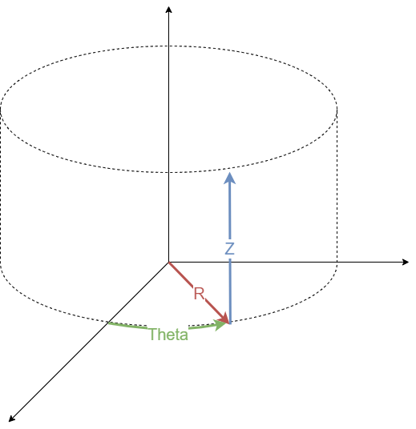
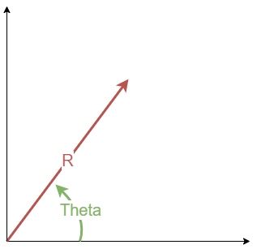
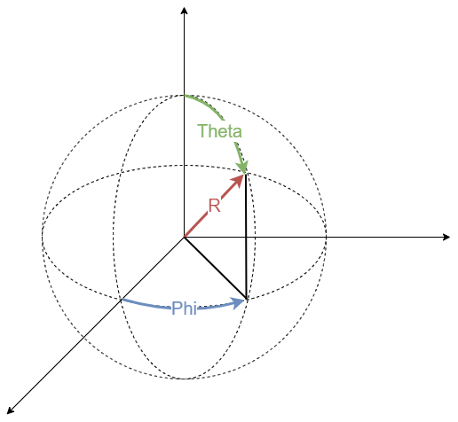

# Peponi.Math


- [Peponi.Math](#peponimath)
  - [1. Instruction](#1-instruction)
    - [1.1. About Peponi.Math](#11-about-peponimath)
      - [1.1.1. Peponi.Math license](#111-peponimath-license)
      - [1.1.2. Peponi.Math install](#112-peponimath-install)
  - [2. Peponi.Math.Coordinates](#2-peponimathcoordinates)
    - [2.1. CartesianCoordinate2D](#21-cartesiancoordinate2d)
    - [2.2. CartesianCoordinate3D](#22-cartesiancoordinate3d)
    - [2.3. CylindricalCoordinate](#23-cylindricalcoordinate)
    - [2.4. PolarCoordinate](#24-polarcoordinate)
    - [2.5. SphericalCoordinate](#25-sphericalcoordinate)
  - [3. Peponi.Math.Integration](#3-peponimathintegration)
    - [3.1. Midpoint](#31-midpoint)


## 1. Instruction


- This package is under MIT License.
- GitHub : [Peponi](https://github.com/peponi-paradise/Peponi)
- Blog : [Peponi](https://peponi-paradise.tistory.com)
- Instruction & API information is on following section


### 1.1. About Peponi.Math


```text
Peponi.Math is a package for Mathematics.
Including contents are:

1. Coordinates
    - Cartesian (2D & 3D)
    - Cylindrical
    - Polar
    - Spherical
2. Numerical integrations
    - Trapezoidal
    - Midpoint
    - Simpson's rule (1/3 & 3/8)
3. Moving Averages
    - Simple moving average
4. Unit conversion
    - Angle
    - Angular speed
    - Area
    - Dry volume
    - Energy
    - Force
    - Length
    - Prefix
    - Pressure
    - Speed
    - Temperature
    - Volume
    - Weight
5. Windowing
    - Tumbling
    - Sliding
    - Hopping
```


#### 1.1.1. Peponi.Math license


```text
The MIT License (MIT)

Copyright (c) 2023 peponi

Permission is hereby granted, free of charge, to any person obtaining a copy
of this software and associated documentation files (the "Software"), to deal
in the Software without restriction, including without limitation the rights
to use, copy, modify, merge, publish, distribute, sublicense, and/or sell
copies of the Software, and to permit persons to whom the Software is
furnished to do so, subject to the following conditions:

The above copyright notice and this permission notice shall be included in all
copies or substantial portions of the Software.

THE SOFTWARE IS PROVIDED "AS IS", WITHOUT WARRANTY OF ANY KIND, EXPRESS OR
IMPLIED, INCLUDING BUT NOT LIMITED TO THE WARRANTIES OF MERCHANTABILITY,
FITNESS FOR A PARTICULAR PURPOSE AND NONINFRINGEMENT. IN NO EVENT SHALL THE
AUTHORS OR COPYRIGHT HOLDERS BE LIABLE FOR ANY CLAIM, DAMAGES OR OTHER
LIABILITY, WHETHER IN AN ACTION OF CONTRACT, TORT OR OTHERWISE, ARISING FROM,
OUT OF OR IN CONNECTION WITH THE SOFTWARE OR THE USE OR OTHER DEALINGS IN THE
SOFTWARE.
```


#### 1.1.2. Peponi.Math install


```text
NuGet\Install-Package Peponi.Math
```


## 2. Peponi.Math.Coordinates


### 2.1. CartesianCoordinate2D


1. Members
    |Type|Name|Description|
    |----|----|-----------|
    |double|X|X axis value<br>Raising `PropertyChanged` event|
    |double|Y|Y axis value<br>Raising `PropertyChanged` event|
    |PropertyChangedEventHandler?|PropertyChanged|INotifyPropertyChanged support|
2. Methods
    |Return type|Name|Description|
    |-----------|----|-----------|
    |CartesianCoordinate2D|CartesianCoordinate2D()|Default constructor|
    |CartesianCoordinate2D|CartesianCoordinate2D(double, double)|Constructor|
    |void|Deconstruct(out double, out double)|Deconstructor|
    |double|GetDistanceFromOrigin()|Returns <code>√(X<sup>2</sup>+Y<sup>2</sup>)</code>|
    |string|ToString()|Returns `X, Y`|
3. Example
    ```cs
    var coordinate = new(3, 4);
    var (x, y) = coordinate;

    Console.WriteLine(coordinate.GetDistanceFromOrigin());
    Console.WriteLine(coordinate.ToString());

    /* output:
    5
    3, 4
    */
    ```


### 2.2. CartesianCoordinate3D


1. Members
    |Type|Name|Description|
    |----|----|-----------|
    |double|X|X axis value<br>Raising `PropertyChanged` event|
    |double|Y|Y axis value<br>Raising `PropertyChanged` event|
    |double|Z|Z axis value<br>Raising `PropertyChanged` event|
    |PropertyChangedEventHandler?|PropertyChanged|INotifyPropertyChanged support|
2. Methods
    |Return type|Name|Description|
    |-----------|----|-----------|
    |CartesianCoordinate3D|CartesianCoordinate3D()|Default constructor|
    |CartesianCoordinate3D|CartesianCoordinate3D(double, double, double)|Constructor|
    |void|Deconstruct(out double, out double, out double)|Deconstructor|
    |double|GetDistanceFromOrigin()|Returns <code>√(X<sup>2</sup>+Y<sup>2</sup>+Z<sup>2</sup>)</code>|
    |string|ToString()|Returns `X, Y, Z`|
3. Example
    ```cs
    var coordinate = new(3, 4, 5);
    var (x, y, z) = coordinate;

    Console.WriteLine(coordinate.GetDistanceFromOrigin());
    Console.WriteLine(coordinate.ToString());

    /* output:
    7.071068 ...
    3, 4, 5
    */
    ```


### 2.3. CylindricalCoordinate



1. Members
    |Type|Name|Description|
    |----|----|-----------|
    |double|R|Radius<br>Raising `PropertyChanged` event|
    |double|Theta|Angle from axis<br>Raising `PropertyChanged` event|
    |double|Z|Z axis value<br>Raising `PropertyChanged` event|
    |PropertyChangedEventHandler?|PropertyChanged|INotifyPropertyChanged support|
2. Methods
    |Return type|Name|Description|
    |-----------|----|-----------|
    |CylindricalCoordinate|CylindricalCoordinate()|Default constructor|
    |CylindricalCoordinate|CylindricalCoordinate(double, double, double)|Constructor|
    |void|Deconstruct(out double, out double, out double)|Deconstructor|
    |double|GetDistanceFromOrigin()|Returns <code>√(R<sup>2</sup>+Z<sup>2</sup>)</code>|
    |string|ToString()|Returns `R, Theta, Z`|
3. Example
    ```cs
    var coordinate = new(3, 4, 5);
    var (r, theta, z) = coordinate;

    Console.WriteLine(coordinate.GetDistanceFromOrigin());
    Console.WriteLine(coordinate.ToString());

    /* output:
    5.830952 ...
    3, 4, 5
    */
    ```


### 2.4. PolarCoordinate



1. Members
    |Type|Name|Description|
    |----|----|-----------|
    |double|R|Radius<br>Raising `PropertyChanged` event|
    |double|Theta|Angle from axis<br>Raising `PropertyChanged` event|
    |PropertyChangedEventHandler?|PropertyChanged|INotifyPropertyChanged support|
2. Methods
    |Return type|Name|Description|
    |-----------|----|-----------|
    |PolarCoordinate|PolarCoordinate()|Default constructor|
    |PolarCoordinate|PolarCoordinate(double, double)|Constructor|
    |void|Deconstruct(out double, out double)|Deconstructor|
    |double|GetDistanceFromOrigin()|Returns `R`|
    |string|ToString()|Returns `R, Theta`|
3. Example
    ```cs
    var coordinate = new(3, 4);
    var (r, theta) = coordinate;

    Console.WriteLine(coordinate.GetDistanceFromOrigin());
    Console.WriteLine(coordinate.ToString());

    /* output:
    3
    3, 4
    */
    ```


### 2.5. SphericalCoordinate



1. Members
    |Type|Name|Description|
    |----|----|-----------|
    |double|R|Radius<br>Raising `PropertyChanged` event|
    |double|Theta|Latitude<br>Raising `PropertyChanged` event|
    |double|Phi|Longitude<br>Raising `PropertyChanged` event|
    |PropertyChangedEventHandler?|PropertyChanged|INotifyPropertyChanged support|
2. Methods
    |Return type|Name|Description|
    |-----------|----|-----------|
    |SphericalCoordinate|SphericalCoordinate()|Default constructor|
    |SphericalCoordinate|SphericalCoordinate(double, double, double)|Constructor|
    |void|Deconstruct(out double, out double, out double)|Deconstructor|
    |double|GetDistanceFromOrigin()|Returns `R`|
    |string|ToString()|Returns `R, Theta, Phi`|
3. Example
    ```cs
    var coordinate = new(3, 4, 5);
    var (r, theta, phi) = coordinate;

    Console.WriteLine(coordinate.GetDistanceFromOrigin());
    Console.WriteLine(coordinate.ToString());

    /* output:
    3
    3, 4, 5
    */
    ```


## 3. Peponi.Math.Integration


### 3.1. Midpoint


