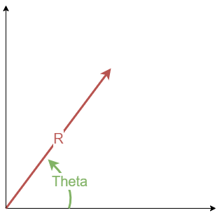
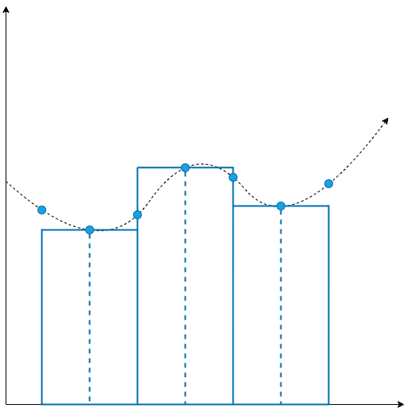
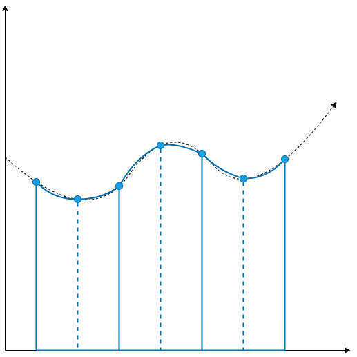
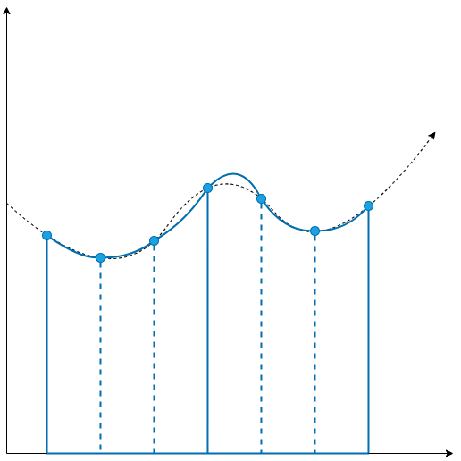
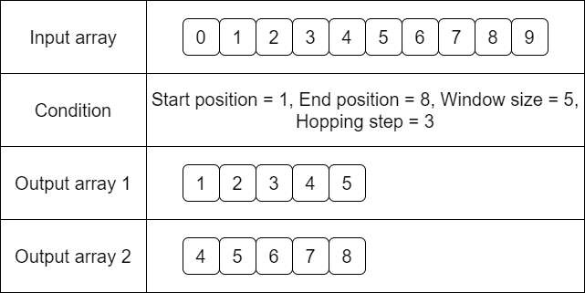
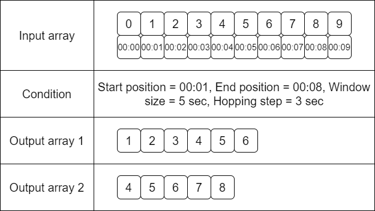
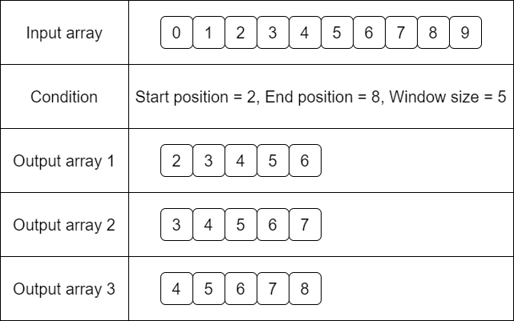

# Peponi.Maths


- [Peponi.Maths](#peponimaths)
  - [1. Instruction](#1-instruction)
    - [1.1. About Peponi.Maths](#11-about-peponimaths)
      - [1.1.1. Peponi.Maths license](#111-peponimaths-license)
      - [1.1.2. Peponi.Maths install](#112-peponimaths-install)
  - [2. Peponi.Maths.Coordinates](#2-peponimathscoordinates)
    - [2.1. CartesianCoordinate2D](#21-cartesiancoordinate2d)
    - [2.2. CartesianCoordinate3D](#22-cartesiancoordinate3d)
    - [2.3. CylindricalCoordinate](#23-cylindricalcoordinate)
    - [2.4. PolarCoordinate](#24-polarcoordinate)
    - [2.5. SphericalCoordinate](#25-sphericalcoordinate)
  - [3. Peponi.Maths.Integration](#3-peponimathsintegration)
    - [3.1. Midpoint](#31-midpoint)
    - [3.2. Simpson 1/3](#32-simpson-13)
    - [3.3. Simpson 3/8](#33-simpson-38)
    - [3.4. Trapezoidal](#34-trapezoidal)
  - [4. Peponi.Maths.MovingAverage](#4-peponimathsmovingaverage)
    - [4.1. SimpleMovingAverage\<T\>](#41-simplemovingaveraget)
  - [5. Peponi.Maths.UnitConversion](#5-peponimathsunitconversion)
    - [5.1. Introduction](#51-introduction)
    - [5.2. Angle](#52-angle)
    - [5.3. AngularSpeed](#53-angularspeed)
    - [5.4. Area](#54-area)
    - [5.5. DryVolume](#55-dryvolume)
    - [5.6. Energy](#56-energy)
    - [5.7. Force](#57-force)
    - [5.8. Length](#58-length)
    - [5.9. Prefix](#59-prefix)
    - [5.10. Pressure](#510-pressure)
    - [5.10. Speed](#510-speed)
    - [5.11. Temperature](#511-temperature)
    - [5.12. Volume](#512-volume)
    - [5.13. Weight](#513-weight)
  - [6. Windowing](#6-windowing)
    - [6.1. Hopping window](#61-hopping-window)
    - [6.2. Sliding window](#62-sliding-window)
    - [6.3. Tumbling window](#63-tumbling-window)


## 1. Instruction


- This package is under MIT License.
- GitHub : [Peponi](https://github.com/peponi-paradise/Peponi)
- Blog : [Peponi](https://peponi-paradise.tistory.com)
- Instruction & API information is on following section


### 1.1. About Peponi.Maths


```text
Peponi.Maths is a package for Mathematics.
Including contents are:

1. Coordinates
    - Cartesian (2D & 3D)
    - Cylindrical
    - Polar
    - Spherical
2. Numerical integrations
    - Trapezoidal
    - Midpoint
    - Simpson's rule (1/3 & 3/8)
3. Moving Averages
    - Simple moving average
4. Unit conversion
    - Angle
    - Angular speed
    - Area
    - Dry volume
    - Energy
    - Force
    - Length
    - Prefix
    - Pressure
    - Speed
    - Temperature
    - Volume
    - Weight
5. Windowing
    - Tumbling
    - Sliding
    - Hopping
```


#### 1.1.1. Peponi.Maths license


```text
The MIT License (MIT)

Copyright (c) 2023 peponi

Permission is hereby granted, free of charge, to any person obtaining a copy
of this software and associated documentation files (the "Software"), to deal
in the Software without restriction, including without limitation the rights
to use, copy, modify, merge, publish, distribute, sublicense, and/or sell
copies of the Software, and to permit persons to whom the Software is
furnished to do so, subject to the following conditions:

The above copyright notice and this permission notice shall be included in all
copies or substantial portions of the Software.

THE SOFTWARE IS PROVIDED "AS IS", WITHOUT WARRANTY OF ANY KIND, EXPRESS OR
IMPLIED, INCLUDING BUT NOT LIMITED TO THE WARRANTIES OF MERCHANTABILITY,
FITNESS FOR A PARTICULAR PURPOSE AND NONINFRINGEMENT. IN NO EVENT SHALL THE
AUTHORS OR COPYRIGHT HOLDERS BE LIABLE FOR ANY CLAIM, DAMAGES OR OTHER
LIABILITY, WHETHER IN AN ACTION OF CONTRACT, TORT OR OTHERWISE, ARISING FROM,
OUT OF OR IN CONNECTION WITH THE SOFTWARE OR THE USE OR OTHER DEALINGS IN THE
SOFTWARE.
```


#### 1.1.2. Peponi.Maths install


```text
NuGet\Install-Package Peponi.Maths
```


## 2. Peponi.Maths.Coordinates


### 2.1. CartesianCoordinate2D


1. Members
    |Type|Name|Description|
    |----|----|-----------|
    |double|X|X axis value<br>Raising `PropertyChanged` event|
    |double|Y|Y axis value<br>Raising `PropertyChanged` event|
    |PropertyChangedEventHandler?|PropertyChanged|INotifyPropertyChanged support|
2. Methods
    |Return type|Name|Description|
    |-----------|----|-----------|
    |CartesianCoordinate2D|CartesianCoordinate2D()|Default constructor|
    |CartesianCoordinate2D|CartesianCoordinate2D(double, double)|Constructor|
    |void|Deconstruct(out double, out double)|Deconstructor|
    |double|GetDistanceFromOrigin()|Returns <code>√(X<sup>2</sup>+Y<sup>2</sup>)</code>|
    |string|ToString()|Returns `X, Y`|
3. Example
    ```cs
    using Peponi.Maths.Coordinates;

    var coordinate = new(3, 4);
    var (x, y) = coordinate;

    Console.WriteLine(coordinate.GetDistanceFromOrigin());
    Console.WriteLine(coordinate.ToString());

    /* output:
    5
    3, 4
    */
    ```


### 2.2. CartesianCoordinate3D


1. Members
    |Type|Name|Description|
    |----|----|-----------|
    |double|X|X axis value<br>Raising `PropertyChanged` event|
    |double|Y|Y axis value<br>Raising `PropertyChanged` event|
    |double|Z|Z axis value<br>Raising `PropertyChanged` event|
    |PropertyChangedEventHandler?|PropertyChanged|INotifyPropertyChanged support|
2. Methods
    |Return type|Name|Description|
    |-----------|----|-----------|
    |CartesianCoordinate3D|CartesianCoordinate3D()|Default constructor|
    |CartesianCoordinate3D|CartesianCoordinate3D(double, double, double)|Constructor|
    |void|Deconstruct(out double, out double, out double)|Deconstructor|
    |double|GetDistanceFromOrigin()|Returns <code>√(X<sup>2</sup>+Y<sup>2</sup>+Z<sup>2</sup>)</code>|
    |string|ToString()|Returns `X, Y, Z`|
3. Example
    ```cs
    using Peponi.Maths.Coordinates;

    var coordinate = new(3, 4, 5);
    var (x, y, z) = coordinate;

    Console.WriteLine(coordinate.GetDistanceFromOrigin());
    Console.WriteLine(coordinate.ToString());

    /* output:
    7.071068 ...
    3, 4, 5
    */
    ```


### 2.3. CylindricalCoordinate


1. Members
    |Type|Name|Description|
    |----|----|-----------|
    |double|R|Radius<br>Raising `PropertyChanged` event|
    |double|Theta|Angle from axis<br>Raising `PropertyChanged` event|
    |double|Z|Z axis value<br>Raising `PropertyChanged` event|
    |PropertyChangedEventHandler?|PropertyChanged|INotifyPropertyChanged support|
2. Methods
    |Return type|Name|Description|
    |-----------|----|-----------|
    |CylindricalCoordinate|CylindricalCoordinate()|Default constructor|
    |CylindricalCoordinate|CylindricalCoordinate(double, double, double)|Constructor|
    |void|Deconstruct(out double, out double, out double)|Deconstructor|
    |double|GetDistanceFromOrigin()|Returns <code>√(R<sup>2</sup>+Z<sup>2</sup>)</code>|
    |string|ToString()|Returns `R, Theta, Z`|
3. Example
    ```cs
    using Peponi.Maths.Coordinates;

    var coordinate = new(3, 4, 5);
    var (r, theta, z) = coordinate;

    Console.WriteLine(coordinate.GetDistanceFromOrigin());
    Console.WriteLine(coordinate.ToString());

    /* output:
    5.830952 ...
    3, 4, 5
    */
    ```


### 2.4. PolarCoordinate



1. Members
    |Type|Name|Description|
    |----|----|-----------|
    |double|R|Radius<br>Raising `PropertyChanged` event|
    |double|Theta|Angle from axis<br>Raising `PropertyChanged` event|
    |PropertyChangedEventHandler?|PropertyChanged|INotifyPropertyChanged support|
2. Methods
    |Return type|Name|Description|
    |-----------|----|-----------|
    |PolarCoordinate|PolarCoordinate()|Default constructor|
    |PolarCoordinate|PolarCoordinate(double, double)|Constructor|
    |void|Deconstruct(out double, out double)|Deconstructor|
    |double|GetDistanceFromOrigin()|Returns `R`|
    |string|ToString()|Returns `R, Theta`|
3. Example
    ```cs
    using Peponi.Maths.Coordinates;

    var coordinate = new(3, 4);
    var (r, theta) = coordinate;

    Console.WriteLine(coordinate.GetDistanceFromOrigin());
    Console.WriteLine(coordinate.ToString());

    /* output:
    3
    3, 4
    */
    ```


### 2.5. SphericalCoordinate


1. Members
    |Type|Name|Description|
    |----|----|-----------|
    |double|R|Radius<br>Raising `PropertyChanged` event|
    |double|Theta|Latitude<br>Raising `PropertyChanged` event|
    |double|Phi|Longitude<br>Raising `PropertyChanged` event|
    |PropertyChangedEventHandler?|PropertyChanged|INotifyPropertyChanged support|
2. Methods
    |Return type|Name|Description|
    |-----------|----|-----------|
    |SphericalCoordinate|SphericalCoordinate()|Default constructor|
    |SphericalCoordinate|SphericalCoordinate(double, double, double)|Constructor|
    |void|Deconstruct(out double, out double, out double)|Deconstructor|
    |double|GetDistanceFromOrigin()|Returns `R`|
    |string|ToString()|Returns `R, Theta, Phi`|
3. Example
    ```cs
    using Peponi.Maths.Coordinates;

    var coordinate = new(3, 4, 5);
    var (r, theta, phi) = coordinate;

    Console.WriteLine(coordinate.GetDistanceFromOrigin());
    Console.WriteLine(coordinate.ToString());

    /* output:
    3
    3, 4, 5
    */
    ```


## 3. Peponi.Maths.Integration


### 3.1. Midpoint



1. Methods
    |Return type|Name|Description|
    |-----------|----|-----------|
    |double|Integrate<X, Y>(List\<X>, List\<Y>)|Integrate points<br>Count of List\<X> & List\<Y> must me equal<br>Count of List\<X> must be odd|
    |double|Integrate(Func<double, double>, double, double, int)|Integrate input function<br>Low limit <= Upper limit<br>Function must not be null|
2. Example
    ```cs
    using Peponi.Maths.Integration;
    
    /// List type

    List<int> xs = new() { 1, 4, 7, 10, 13 };
    List<double> ys = new() { 0, 1, -1, 4, 7 };

    Console.WriteLine(Midpoint.Integrate(xs, ys));

    /* output:
    30
    */
    ```
    ```cs
    using Peponi.Maths.Extensions;
    using Peponi.Maths.Integration;

    /// Function type

    Console.WriteLine(Midpoint.Integrate(System.Math.Sin, 0, 17.2, 9).Round(6));

    /* output:
    1.262177
    */
    ```


### 3.2. Simpson 1/3



1. Methods
    |Return type|Name|Description|
    |-----------|----|-----------|
    |double|Integrate<X, Y>(List\<X>, List\<Y>)|Integrate points<br>Count of List\<X> & List\<Y> must me equal<br>Count of List\<X> must be odd|
    |double|Integrate(Func<double, double>, double, double, int)|Integrate input function<br>Low limit <= Upper limit<br>Function must not be null<br>Interval count should be even|
2. Example
    ```cs
    using Peponi.Maths.Integration;

    /// List type

    List<int> xs = new() { 1, 4, 7, 10, 13 };
    List<double> ys = new() { 0, 1, -1, 4, 7 };

    Console.WriteLine(Simpson1over3.Integrate(xs, ys));

    /* output:
    25
    */
    ```
    ```cs
    using Peponi.Maths.Extensions;
    using Peponi.Maths.Integration;

    /// Function type

    Console.WriteLine(Simpson1over3.Integrate(System.Math.Sin, 0, 17.2, 8).Round(6));

    /* output:
    1.341822
    */
    ```


### 3.3. Simpson 3/8



1. Methods
    |Return type|Name|Description|
    |-----------|----|-----------|
    |double|Integrate<X, Y>(List\<X>, List\<Y>)|Integrate points<br>Count of List\<X> & List\<Y> must me equal<br>Count of List\<X> must be multiple of 3|
    |double|Integrate(Func<double, double>, double, double, int)|Integrate input function<br>Low limit <= Upper limit<br>Function must not be null<br>Interval count should be multiple of 3|
2. Example
    ```cs
    using Peponi.Maths.Integration;

    /// List type

    List<int> xs = new() { 1, 4, 7, 10, 13, 16, 19 };
    List<double> ys = new() { 0, 1, -1, 4, 7, -2, 5 };

    Console.WriteLine(Simpson3over8.Integrate(xs, ys));

    /* output:
    31.5
    */
    ```
    ```cs
    using Peponi.Maths.Extensions;
    using Peponi.Maths.Integration;

    /// Function type

    Console.WriteLine(Simpson3over8.Integrate(System.Math.Sin, 0, 17.2, 9).Round(6));

    /* output:
    2.189858
    */
    ```


### 3.4. Trapezoidal


1. Methods
    |Return type|Name|Description|
    |-----------|----|-----------|
    |double|Integrate<X, Y>(List\<X>, List\<Y>)|Integrate points<br>Count of List\<X> & List\<Y> must me equal<br>Count of List\<X> should be over than 1|
    |double|Integrate(Func<double, double>, double, double, int)|Integrate input function<br>Low limit <= Upper limit<br>Function must not be null|
2. Example
    ```cs
    using Peponi.Maths.Integration;

    /// List type

    List<int> xs = new() { 1, 4, 8, 12, 15, 20 };
    List<double> ys = new() { 0, 1, -1, 4, 7, 5 };

    Console.WriteLine(Trapezoidal.Integrate(xs, ys));

    /* output:
    54
    */
    ```
    ```cs
    using Peponi.Maths.Extensions;
    using Peponi.Maths.Integration;

    /// Function type

    Console.WriteLine(Trapezoidal.Integrate(System.Math.Sin, 0, 17.2, 8).Round(6));

    /* output:
    0.627166
    */
    ```


## 4. Peponi.Maths.MovingAverage


### 4.1. SimpleMovingAverage\<T>


1. Methods
    |Return type|Name|Description|
    |-----------|----|-----------|
    |SimpleMovingAverage|SimpleMovingAverage(uint)|Window size could not be 0|
    |T|Average(T)|Returns average value|
2. Example
    ```cs
    using Peponi.Maths.MovingAverage;

    SimpleMovingAverage<double> movingAverage = new(3);

    for (int i = 1; i < 5; i++)
    {
        Console.WriteLine(movingAverage.Average(i));
    }

    /* output:
    1
    1.5
    2
    3
    */
    ```


## 5. Peponi.Maths.UnitConversion


### 5.1. Introduction


- Call UnitConvert.Convert\<T>(T, Enum, Enum) for converting unit.
- The name of enums are full name. Symbol and descriptions could find on comments.


### 5.2. Angle


```cs
using Peponi.Maths.Extensions;
using Peponi.Maths.UnitConversion;

Console.WriteLine(UnitConvert.Convert(1.234, AngleUnit.Degree, AngleUnit.Radian).Round(6));

/* output:
0.021537
*/
```


### 5.3. AngularSpeed


```cs
using Peponi.Maths.Extensions;
using Peponi.Maths.UnitConversion;

Console.WriteLine(UnitConvert.Convert(21.653, AngularSpeedUnit.RadianPerSecond, AngularSpeedUnit.RadianPerMinute).Round(6));

/* output:
1299.18
*/
```


### 5.4. Area


```cs
using Peponi.Maths.Extensions;
using Peponi.Maths.UnitConversion;

Console.WriteLine(UnitConvert.Convert(21.653, AreaUnit.SquareMeter, AreaUnit.SquareFoot).Round(8));

/* output:
233.07095225
*/
```


### 5.5. DryVolume


```cs
using Peponi.Maths.Extensions;
using Peponi.Maths.UnitConversion;

Console.WriteLine(UnitConvert.Convert(21.653, DryVolumeUnit.Liter, DryVolumeUnit.Barrel).Round(6));

/* output:
0.187266
*/
```


### 5.6. Energy


```cs
using Peponi.Maths.Extensions;
using Peponi.Maths.UnitConversion;

Console.WriteLine(UnitConvert.Convert(21.653, EnergyUnit.Joule, EnergyUnit.WattHour).Round(6));

/* output:
0.006015
*/
```


### 5.7. Force


```cs
using Peponi.Maths.Extensions;
using Peponi.Maths.UnitConversion;

Console.WriteLine(UnitConvert.Convert(21.653, ForceUnit.Newton, ForceUnit.KiloGramForce).Round(6));

/* output:
2.207992
*/
```


### 5.8. Length


```cs
using Peponi.Maths.Extensions;
using Peponi.Maths.UnitConversion;

Console.WriteLine(UnitConvert.Convert(21.653, LengthUnit.Meter, LengthUnit.Mile).Round(6));

/* output:
0.013455
*/
```


### 5.9. Prefix


```cs
using Peponi.Maths.UnitConversion;

Console.WriteLine(UnitConvert.Convert(21.653, PrefixUnit.None, PrefixUnit.Kilo));

/* output:
21.653E-3
*/
```


### 5.10. Pressure


```cs
using Peponi.Maths.Extensions;
using Peponi.Maths.UnitConversion;

Console.WriteLine(UnitConvert.Convert(21.653, PressureUnit.Pascal, PressureUnit.Torr).Round(9));

/* output:
0.162410856
*/
```


### 5.10. Speed


```cs
using Peponi.Maths.Extensions;
using Peponi.Maths.UnitConversion;

Console.WriteLine(UnitConvert.Convert(21.653, SpeedUnit.MeterPerSecond, SpeedUnit.MilePerHour).Round(6));

/* output:
48.436382
*/
```


### 5.11. Temperature


```cs
using Peponi.Maths.Extensions;
using Peponi.Maths.UnitConversion;

Console.WriteLine(UnitConvert.Convert(21.653, TemperatureUnit.Celsius, TemperatureUnit.Fahrenheit).Round(6));

/* output:
70.9754
*/
```


### 5.12. Volume


```cs
using Peponi.Maths.Extensions;
using Peponi.Maths.UnitConversion;

Console.WriteLine(UnitConvert.Convert(21.653, VolumeUnit.CubicMeter, VolumeUnit.CubicYard).Round(6));

/* output:
28.321055
*/
```


### 5.13. Weight


```cs
using Peponi.Maths.Extensions;
using Peponi.Maths.UnitConversion;

Console.WriteLine(UnitConvert.Convert(21.653, WeightUnit.KiloGram, WeightUnit.Pound).Round(6));

/* output:
47.736694
*/
```


## 6. Windowing


### 6.1. Hopping window






1. Methods
    |Return type|Name|Description|
    |-----------|----|-----------|
    |IEnumerable<IEnumerable\<T>>|ToHoppingWindows(IEnumerable\<T>, uint, uint)|Get windows for given parameters|
    |Task<IEnumerable<IEnumerable\<T>>>|ToHoppingWindowsAsync(IEnumerable\<T>, uint, uint)||
    |IEnumerable<IEnumerable\<T>>|ToHoppingWindows(IEnumerable\<T>, uint, uint, uint)||
    |Task<IEnumerable<IEnumerable\<T>>>|ToHoppingWindowsAsync(IEnumerable\<T>, uint, uint, uint)||
    |IEnumerable<IEnumerable\<T>>|ToHoppingWindows(IEnumerable\<T>, uint, uint, uint, uint)||
    |Task<IEnumerable<IEnumerable\<T>>>|ToHoppingWindowsAsync(IEnumerable\<T>, uint, uint, uint, uint)||
    |IEnumerable<IEnumerable\<V>>|ToHoppingWindows(IEnumerable\<T>, uint, uint, Func<T, V>)||
    |Task<IEnumerable<IEnumerable\<V>>>|ToHoppingWindowsAsync(IEnumerable\<T>, uint, uint, Func<T, V>)||
    |IEnumerable<IEnumerable\<V>>|ToHoppingWindows(IEnumerable\<T>, uint, uint, uint, Func<T, V>)||
    |Task<IEnumerable<IEnumerable\<V>>>|ToHoppingWindowsAsync(IEnumerable\<T>, uint, uint, uint, Func<T, V>)||
    |IEnumerable<IEnumerable\<V>>|ToHoppingWindows(IEnumerable\<T>, uint, uint, uint, uint, Func<T, V>)||
    |Task<IEnumerable<IEnumerable\<V>>>|ToHoppingWindowsAsync(IEnumerable\<T>, uint, uint, uint, uint, Func<T, V>)||
    |IEnumerable<IEnumerable\<DateTime>>|ToHoppingWindows(IEnumerable\<DateTime>, DateTime, TimeSpan, TimeSpan)||
    |Task<IEnumerable<IEnumerable\<DateTime>>>|ToHoppingWindowsAsync(IEnumerable\<DateTime>, DateTime, TimeSpan, TimeSpan)||
    |IEnumerable<IEnumerable\<DateTime>>|ToHoppingWindows(IEnumerable\<DateTime>, DateTime, DateTime, TimeSpan, TimeSpan)||
    |Task<IEnumerable<IEnumerable\<DateTime>>>|ToHoppingWindowsAsync(IEnumerable\<DateTime>, DateTime, DateTime, TimeSpan, TimeSpan)||
    |IEnumerable<IEnumerable\<V>>|ToHoppingWindows(IEnumerable\<T>, DateTime, TimeSpan, TimeSpan, Func<T, DateTime>, Func<T, V>)||
    |Task<IEnumerable<IEnumerable\<V>>>|ToHoppingWindowsAsync(IEnumerable\<T>, DateTime, TimeSpan, TimeSpan, Func<T, DateTime>, Func<T, V>)||
    |IEnumerable<IEnumerable\<V>>|ToHoppingWindows(IEnumerable\<T>, DateTime, DateTime, TimeSpan, TimeSpan, Func<T, DateTime>, Func<T, V>)||
    |Task<IEnumerable<IEnumerable\<V>>>|ToHoppingWindowsAsync(IEnumerable\<T>, DateTime, DateTime, TimeSpan, TimeSpan, Func<T, DateTime>, Func<T, V>)||
2. Example
    ```cs
    internal class DataClass
    {
        public DateTime Time;
        public int Data;

        public DataClass(int data)
        {
            Data = data;
        }

        public DataClass(DateTime time, int data)
        {
            Time = time;
            Data = data;
        }
    }
    ```
    ```cs
    using Peponi.Maths.Windowing;

    List<int> datas = new();
    for (int i = 0; i < 10; i++) datas.Add(i);

    var result = HoppingWindows.ToHoppingWindows(datas, 1, 8, 5, 3);
    foreach (var arr in result) Console.WriteLine(string.Join(", ", arr));

    /* output:
    1, 2, 3, 4, 5
    4, 5, 6, 7, 8
    */
    ```
    ```cs
    using Peponi.Maths.Windowing;

    List<DataClass> datas = new();
    for (int i = 0; i < 10; i++) datas.Add(new(i));

    var result = HoppingWindows.ToHoppingWindows(datas, 1, 8, 5, 3, x => x.Data);
    foreach (var arr in result) Console.WriteLine(string.Join(", ", arr));

    /* output:
    1, 2, 3, 4, 5
    4, 5, 6, 7, 8
    */
    ```
    ```cs
    using Peponi.Maths.Windowing;

    List<DateTime> datas = new();
    for (int i = 0; i < 10; i++) datas.Add(DateTime.Today + TimeSpan.FromSeconds(i));

    var result = HoppingWindows.ToHoppingWindows(datas, DateTime.Today + TimeSpan.FromSeconds(1),
                                                 DateTime.Today + TimeSpan.FromSeconds(8), TimeSpan.FromSeconds(5), TimeSpan.FromSeconds(3));
    foreach (var arr in result) Console.WriteLine(string.Join(", ", arr.Select(x => x.ToString("HH.mm.ss"))));

    /* output:
    00.00.01, 00.00.02, 00.00.03, 00.00.04, 00.00.05, 00.00.06
    00.00.04, 00.00.05, 00.00.06, 00.00.07, 00.00.08
    */
    ```
    ```cs
    using Peponi.Maths.Windowing;

    List<DataClass> datas = new();
    for (int i = 0; i < 10; i++) datas.Add(new(DateTime.Today + TimeSpan.FromSeconds(i) + TimeSpan.FromMilliseconds(i), i));

    var result = SlidingWindows.ToSlidingWindows(datas, DateTime.Today + TimeSpan.FromSeconds(1),
                                                 DateTime.Today + TimeSpan.FromSeconds(8), TimeSpan.FromSeconds(5), x => x.Time, x => x.Data);
    foreach (var arr in result) Console.WriteLine(string.Join(", ", arr));

    /* output:
    1, 2, 3, 4, 5
    2, 3, 4, 5, 6
    3, 4, 5, 6, 7
    */
    ```


### 6.2. Sliding window





1. Methods
    |Return type|Name|Description|
    |-----------|----|-----------|
    |IEnumerable<IEnumerable\<T>>|ToSlidingWindows(IEnumerable\<T>, uint)|Get windows for given parameters|
    |Task<IEnumerable<IEnumerable\<T>>>|ToSlidingWindowsAsync(IEnumerable\<T>, uint)||
    |IEnumerable<IEnumerable\<T>>|ToSlidingWindows(IEnumerable\<T>, uint, uint)||
    |Task<IEnumerable<IEnumerable\<T>>>|ToSlidingWindowsAsync(IEnumerable\<T>, uint, uint)||
    |IEnumerable<IEnumerable\<T>>|ToSlidingWindows(IEnumerable\<T>, uint, uint, uint)||
    |Task<IEnumerable<IEnumerable\<T>>>|ToSlidingWindowsAsync(IEnumerable\<T>, uint, uint, uint)||
    |IEnumerable<IEnumerable\<V>>|ToSlidingWindows(IEnumerable\<T>, uint, Func<T, V>)||
    |Task<IEnumerable<IEnumerable\<V>>>|ToSlidingWindowsAsync(IEnumerable\<T>, uint, Func<T, V>)||
    |IEnumerable<IEnumerable\<V>>|ToSlidingWindows(IEnumerable\<T>, uint, uint, Func<T, V>)||
    |Task<IEnumerable<IEnumerable\<V>>>|ToSlidingWindowsAsync(IEnumerable\<T>, uint, uint, Func<T, V>)||
    |IEnumerable<IEnumerable\<V>>|ToSlidingWindows(IEnumerable\<T>, uint, uint, uint, Func<T, V>)||
    |Task<IEnumerable<IEnumerable\<V>>>|ToSlidingWindowsAsync(IEnumerable\<T>, uint, uint, uint, Func<T, V>)||
    |IEnumerable<IEnumerable\<DateTime>>|ToSlidingWindows(IEnumerable\<DateTime>, DateTime, TimeSpan)||
    |Task<IEnumerable<IEnumerable\<DateTime>>>|ToSlidingWindowsAsync(IEnumerable\<DateTime>, DateTime, TimeSpan)||
    |IEnumerable<IEnumerable\<DateTime>>|ToSlidingWindows(IEnumerable\<DateTime>, DateTime, DateTime, TimeSpan)||
    |Task<IEnumerable<IEnumerable\<DateTime>>>|ToSlidingWindowsAsync(IEnumerable\<DateTime>, DateTime, DateTime, TimeSpan)||
    |IEnumerable<IEnumerable\<V>>|ToSlidingWindows(IEnumerable\<T>, DateTime, TimeSpan, Func<T, DateTime>, Func<T, V>)||
    |Task<IEnumerable<IEnumerable\<V>>>|ToSlidingWindowsAsync(IEnumerable\<T>, DateTime, TimeSpan, Func<T, DateTime>, Func<T, V>)||
    |IEnumerable<IEnumerable\<V>>|ToSlidingWindows(IEnumerable\<T>, DateTime, DateTime, TimeSpan, Func<T, DateTime>, Func<T, V>)||
    |Task<IEnumerable<IEnumerable\<V>>>|ToSlidingWindowsAsync(IEnumerable\<T>, DateTime, DateTime, TimeSpan, Func<T, DateTime>, Func<T, V>)||
2. Example
    ```cs
    internal class DataClass
    {
        public DateTime Time;
        public int Data;

        public DataClass(int data)
        {
            Data = data;
        }

        public DataClass(DateTime time, int data)
        {
            Time = time;
            Data = data;
        }
    }
    ```
    ```cs
    using Peponi.Maths.Windowing;

    List<int> datas = new();
    for (int i = 0; i < 10; i++) datas.Add(i);

    var result = SlidingWindows.ToSlidingWindows(datas, 2, 8, 5);
    foreach (var arr in result) Console.WriteLine(string.Join(", ", arr));

    /* output:
    2, 3, 4, 5, 6
    3, 4, 5, 6, 7
    4, 5, 6, 7, 8
    */
    ```
    ```cs
    using Peponi.Maths.Windowing;

    List<DataClass> datas = new();
    for (int i = 0; i < 10; i++) datas.Add(new(i));

    var result = SlidingWindows.ToSlidingWindows(datas, 2, 8, 5, x => x.Data);
    foreach (var arr in result) Console.WriteLine(string.Join(", ", arr));

    /* output:
    2, 3, 4, 5, 6
    3, 4, 5, 6, 7
    4, 5, 6, 7, 8
    */
    ```
    ```cs
    using Peponi.Maths.Windowing;

    List<DateTime> datas = new();
    for (int i = 0; i < 10; i++) datas.Add(DateTime.Today + TimeSpan.FromSeconds(i));

    var result = SlidingWindows.ToSlidingWindows(datas, DateTime.Today + TimeSpan.FromSeconds(1),
                                                 DateTime.Today + TimeSpan.FromSeconds(8), TimeSpan.FromSeconds(5));
    foreach (var arr in result) Console.WriteLine(string.Join(", ", arr.Select(x => x.ToString("HH.mm.ss"))));

    /* output:
    00.00.01, 00.00.02, 00.00.03, 00.00.04, 00.00.05, 00.00.06
    00.00.02, 00.00.03, 00.00.04, 00.00.05, 00.00.06, 00.00.07
    00.00.03, 00.00.04, 00.00.05, 00.00.06, 00.00.07, 00.00.08
    */
    ```
    ```cs
    using Peponi.Maths.Windowing;

    List<DataClass> datas = new();
    for (int i = 0; i < 10; i++) datas.Add(new(DateTime.Today + TimeSpan.FromSeconds(i) + TimeSpan.FromMilliseconds(i), i));

    var result = SlidingWindows.ToSlidingWindows(datas, DateTime.Today + TimeSpan.FromSeconds(1),
                                                 DateTime.Today + TimeSpan.FromSeconds(8), TimeSpan.FromSeconds(5), x => x.Time, x => x.Data);
    foreach (var arr in result) Console.WriteLine(string.Join(", ", arr));

    /* output:
    1, 2, 3, 4, 5
    2, 3, 4, 5, 6
    3, 4, 5, 6, 7
    */
    ```


### 6.3. Tumbling window


1. Methods
    |Return type|Name|Description|
    |-----------|----|-----------|
    |IEnumerable<IEnumerable\<T>>|ToTumblingWindows(IEnumerable\<T>, uint)|Get windows for given parameters|
    |Task<IEnumerable<IEnumerable\<T>>>|ToTumblingWindowsAsync(IEnumerable\<T>, uint)||
    |IEnumerable<IEnumerable\<T>>|ToTumblingWindows(IEnumerable\<T>, uint, uint)||
    |Task<IEnumerable<IEnumerable\<T>>>|ToTumblingWindowsAsync(IEnumerable\<T>, uint, uint)||
    |IEnumerable<IEnumerable\<T>>|ToTumblingWindows(IEnumerable\<T>, uint, uint, uint)||
    |Task<IEnumerable<IEnumerable\<T>>>|ToTumblingWindowsAsync(IEnumerable\<T>, uint, uint, uint)||
    |IEnumerable<IEnumerable\<V>>|ToTumblingWindows(IEnumerable\<T>, uint, Func<T, V>)||
    |Task<IEnumerable<IEnumerable\<V>>>|ToTumblingWindowsAsync(IEnumerable\<T>, uint, Func<T, V>)||
    |IEnumerable<IEnumerable\<V>>|ToTumblingWindows(IEnumerable\<T>, uint, uint, Func<T, V>)||
    |Task<IEnumerable<IEnumerable\<V>>>|ToTumblingWindowsAsync(IEnumerable\<T>, uint, uint, Func<T, V>)||
    |IEnumerable<IEnumerable\<V>>|ToTumblingWindows(IEnumerable\<T>, uint, uint, uint, Func<T, V>)||
    |Task<IEnumerable<IEnumerable\<V>>>|ToTumblingWindowsAsync(IEnumerable\<T>, uint, uint, uint, Func<T, V>)||
    |IEnumerable<IEnumerable\<DateTime>>|ToTumblingWindows(IEnumerable\<DateTime>, DateTime, TimeSpan)||
    |Task<IEnumerable<IEnumerable\<DateTime>>>|ToTumblingWindowsAsync(IEnumerable\<DateTime>, DateTime, TimeSpan)||
    |IEnumerable<IEnumerable\<DateTime>>|ToTumblingWindows(IEnumerable\<DateTime>, DateTime, DateTime, TimeSpan)||
    |Task<IEnumerable<IEnumerable\<DateTime>>>|ToTumblingWindowsAsync(IEnumerable\<DateTime>, DateTime, DateTime, TimeSpan)||
    |IEnumerable<IEnumerable\<V>>|ToTumblingWindows(IEnumerable\<T>, DateTime, TimeSpan, Func<T, DateTime>, Func<T, V>)||
    |Task<IEnumerable<IEnumerable\<V>>>|ToTumblingWindowsAsync(IEnumerable\<T>, DateTime, TimeSpan, Func<T, DateTime>, Func<T, V>)||
    |IEnumerable<IEnumerable\<V>>|ToTumblingWindows(IEnumerable\<T>, DateTime, DateTime, TimeSpan, Func<T, DateTime>, Func<T, V>)||
    |Task<IEnumerable<IEnumerable\<V>>>|ToTumblingWindowsAsync(IEnumerable\<T>, DateTime, DateTime, TimeSpan, Func<T, DateTime>, Func<T, V>)||
2. Example
    ```cs
    internal class DataClass
    {
        public DateTime Time;
        public int Data;

        public DataClass(int data)
        {
            Data = data;
        }

        public DataClass(DateTime time, int data)
        {
            Time = time;
            Data = data;
        }
    }
    ```
    ```cs
    using Peponi.Maths.Windowing;

    List<int> datas = new();
    for (int i = 0; i < 10; i++) datas.Add(i);

    var result = TumblingWindows.ToTumblingWindows(datas, 2, 8, 5);
    foreach (var arr in result) Console.WriteLine(string.Join(", ", arr));

    /* output:
    2, 3, 4, 5, 6
    7, 8
    */
    ```
    ```cs
    using Peponi.Maths.Windowing;

    List<DataClass> datas = new();
    for (int i = 0; i < 10; i++) datas.Add(new(i));

    var result = TumblingWindows.ToTumblingWindows(datas, 3, 8, 5, x => x.Data);
    foreach (var arr in result) Console.WriteLine(string.Join(", ", arr));

    /* output:
    3, 4, 5, 6, 7
    8
    */
    ```
    ```cs
    using Peponi.Maths.Windowing;

    List<DataClass> datas = new();
    for (int i = 0; i < 10; i++) datas.Add(new(DateTime.Today + TimeSpan.FromSeconds(i), i));

    var result = TumblingWindows.ToTumblingWindows(datas, DateTime.Today, TimeSpan.FromSeconds(5), x => x.Time, x => x.Data);
    foreach (var arr in result) Console.WriteLine(string.Join(", ", arr));

    /* output:
    0, 1, 2, 3, 4, 5
    5, 6, 7, 8, 9
    */
    ```
    ```cs
    using Peponi.Maths.Windowing;

    List<DataClass> datas = new();
    for (int i = 0; i < 10; i++) datas.Add(new(DateTime.Today + TimeSpan.FromSeconds(i) + TimeSpan.FromMilliseconds(i), i));

    var result = TumblingWindows.ToTumblingWindows(datas, DateTime.Today + TimeSpan.FromSeconds(1),
                                                   DateTime.Today + TimeSpan.FromSeconds(8), TimeSpan.FromSeconds(5),
                                                   x => x.Time, x => x.Data);
    foreach (var arr in result) Console.WriteLine(string.Join(", ", arr));

    /* output:
    1, 2, 3, 4, 5
    6, 7
    */
    ```